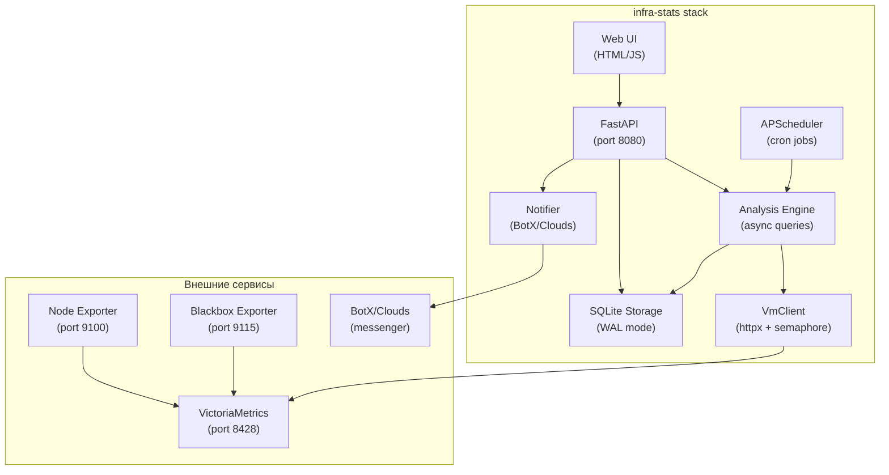
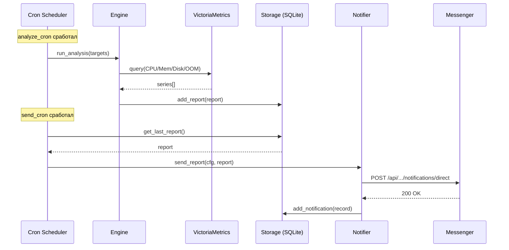
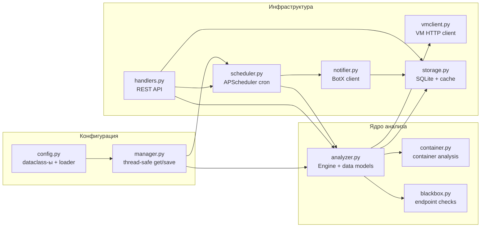
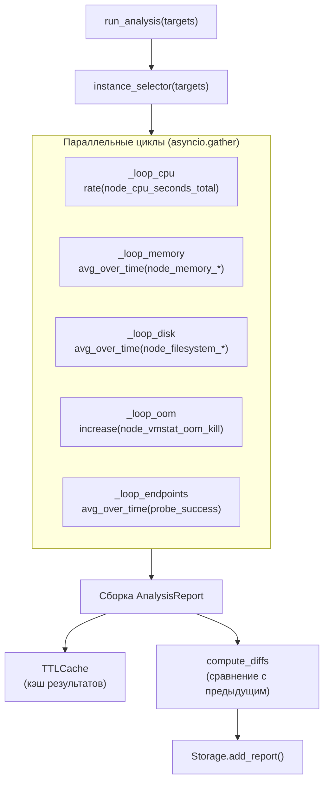
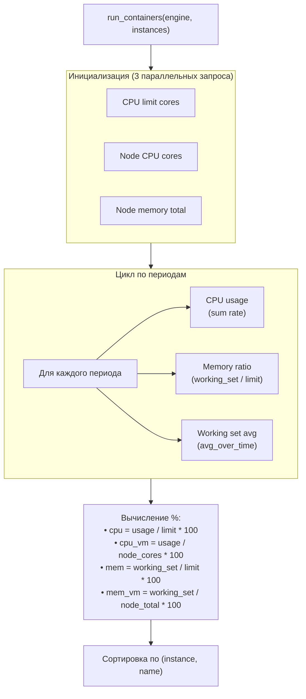
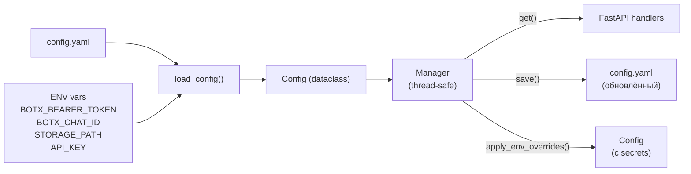
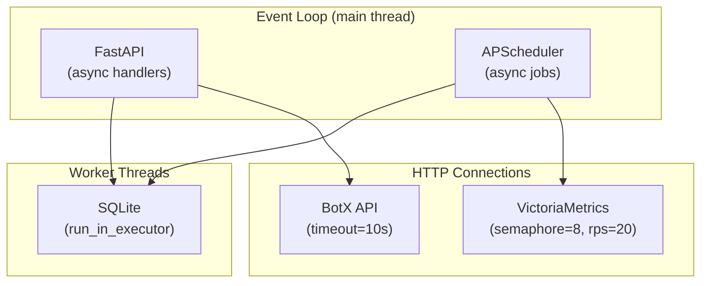
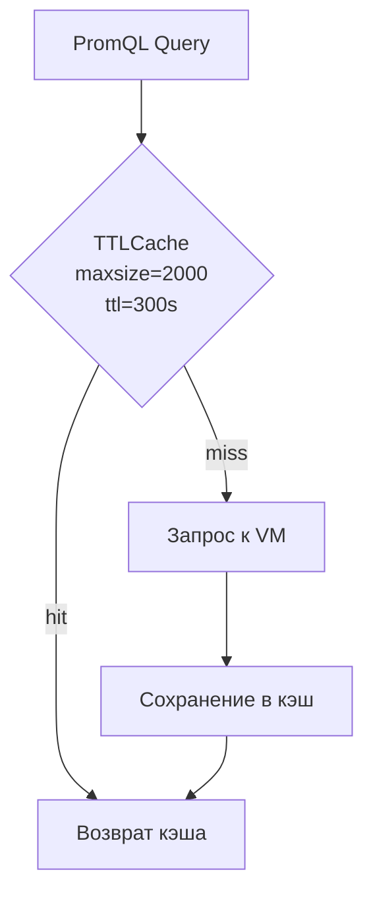
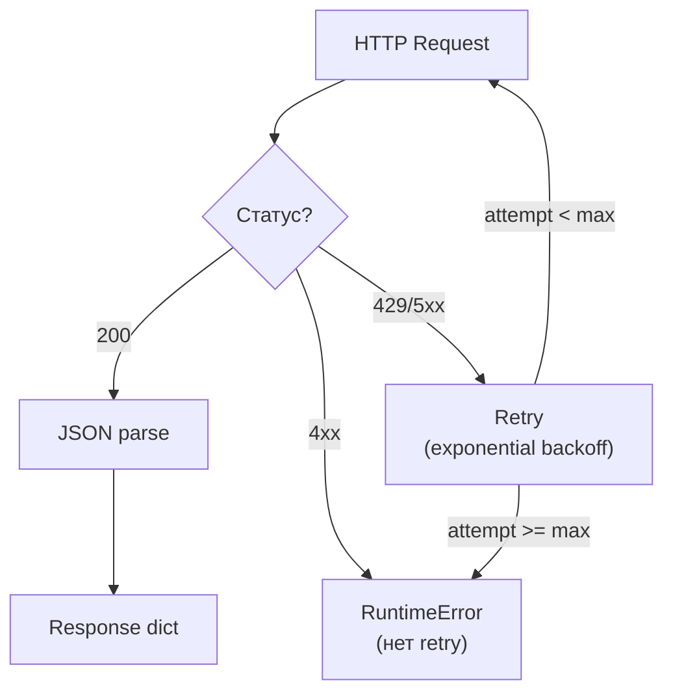

# Архитектура infra-stats

## Обзор системы

## Жизненный цикл данных

## Модульная архитектура

## Pipeline анализа

## Pipeline анализа контейнеров

## Управление конфигурацией

## Потоковая модель

## Кэширование

## Обработка ошибок и retry

