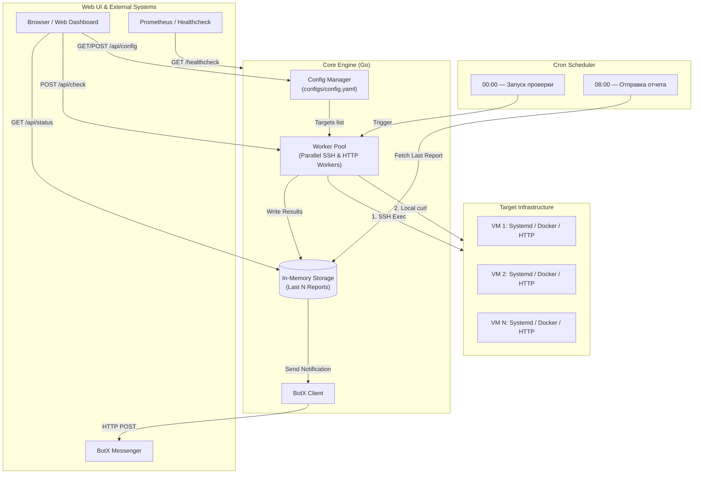

---

# 📚 Документация сервиса SSH Service Checker

**SSH Service Checker** — это отказоустойчивый и лёгкий сервис на Go, предназначенный для мониторинга инфраструктуры по SSH и через HTTP(S). Сервис выполняет проверки с помощью безагентного подхода, сохраняет историю в оперативной памяти, отдает результаты через REST API/Web UI и отправляет сводки в мессенджер BotX по расписанию.

---

## 🏗 Архитектура и поток данных

Сервис использует параллельный **Worker Pool** для опроса целевых виртуальных машин, планировщик **Cron** для автоматизации задач и встроенный **Web-интерфейс**.



---

## 📁 Структура проекта

```text
.
├── cmd/
│   ├── main.go               # Точка входа приложения, роутинг, graceful shutdown
│   └── web/
│       └── index.html        # Embedded Web UI (VictoriaLogs style)
├── configs/
│   ├── config.yaml           # Основной файл конфигурации
│   └── keys/
│       └── id_rsa            # Приватные SSH-ключи для доступа к ВМ
├── internal/
│   ├── checker/              # Логика проверок (Systemctl, Docker inspect, Curl)
│   ├── config/               # Менеджер конфигурации (YAML parsing/saving)
│   ├── health/               # /healthcheck эндпоинт
│   ├── notifier/             # Клиент отправки сообщений в BotX
│   ├── scheduler/            # Крон-планировщик (robfig/cron)
│   ├── sshclient/            # SSH-клиент на базе golang.org/x/crypto/ssh
│   ├── storage/              # Потокобезопасное In-Memory хранилище
│   └── web/                  # Обработчики REST API
├── Dockerfile                # Multi-stage сборка (Alpine + Go)
├── docker-compose.yml        # Compose-файл с настройками безопасности
├── go.mod
└── go.sum

```

---

## ⚙️ Конфигурация (`configs/config.yaml`)

Файл конфигурации поддерживает указание настроек веб-сервера, крона, интеграции с BotX и списка целевых машин.

```yaml
server_port: "8080"

scheduler:
  check_cron: "0 0 * * *"     # Запуск проверки каждый день в 00:00
  send_cron: "0 8 * * *"      # Отправка отчета в BotX каждый день в 08:00

messenger:
  api_url: "https://botx.domain.com/api/v1/messages"
  bearer_token: "YOUR_BOTX_BEARER_TOKEN"
  chat_id: "YOUR_GROUP_CHAT_ID"

targets:
  - id: "vps-vpn"
    name: "VPS VPN Server"
    host: "38.180.35.94"
    port: 22
    user: "root"
    ssh_key_path: "./configs/keys/id_rsa"
    
    # Проверка юнитов systemd
    systemd:
      - "x-ui"
      
    # Проверка Docker-контейнеров
    containers:
      - "mtproto-proxy"
      - "socks5_proxy"
      
    # Проверка HTTP(S) эндпоинтов через curl на целевом узле
    http_checks:
      - url: "http://127.0.0.1:2052/login"
        valid_status_codes: [200, 201, 202, 203, 204, 205, 206, 207, 208, 226, 401, 403]
      - url: "https://my-domain.com/health"
        # Если valid_status_codes не задан, валидными считаются коды 2xx (200-299)

```

---

## 🌐 REST API Endpoints

| Метод | Эндпоинт | Описание |
| --- | --- | --- |
| `GET` | `/healthcheck` | Проверка жизнеспособности самого сервиса. Возвращает статус `200 OK` и текст `ItsOk`. |
| `GET` | `/api/status` | Получить последний сохраненный отчет о проверке инфраструктуры. |
| `POST` | `/api/check` | Принудительно запустить ручную проверку всех ВМ прямо сейчас. |
| `POST` | `/api/send` | Вручную отправить последний отчет в BotX. |
| `POST` | `/api/clear` | Очистить историю проверок в In-Memory хранилище. |
| `GET` | `/api/config` | Получить текущую конфигурацию сервиса в формате JSON. |
| `POST` | `/api/config` | Обновить конфигурацию (сохраняет изменения на диск в `config.yaml`). |

---

## 🚀 Запуск и деплоймент

### Запуск через Docker Compose (Рекомендуемый)

Для запуска с обеспечением максимальной безопасности (Non-root user `appuser`, `cap_drop: ALL`, `no-new-privileges`):

```bash
# 1. Положите SSH-ключи в папку configs/keys/
cp ~/.ssh/id_rsa ./configs/keys/id_rsa
chmod 600 ./configs/keys/id_rsa

# 2. Сборка и фоновый запуск
sudo docker compose up -d --build

# 3. Проверка статуса (ожидайте статус healthy)
sudo docker compose ps

```

### Локальный запуск без Docker

```bash
# Загрузка зависимостей
go mod tidy

# Запуск
go run cmd/main.go

```

---

## 🔐 Безопасность

1. **Безагентный доступ:** Для работы сервиса не нужно устанавливать агенты на целевые ВМ — достаточно SSH-доступа по ключу с правами на чтение (`systemctl is-active`, `docker inspect`, `curl`).
2. **Контейнеризация:**
* Сборка осуществляется в изолированном multi-stage Docker-образе.
* Контейнер запускается от имени непривилегированного пользователя `appuser`.
* Сброшены все Linux Capabilities (`cap_drop: ALL`).
* Запрещено повышение привилегий (`no-new-privileges=true`).