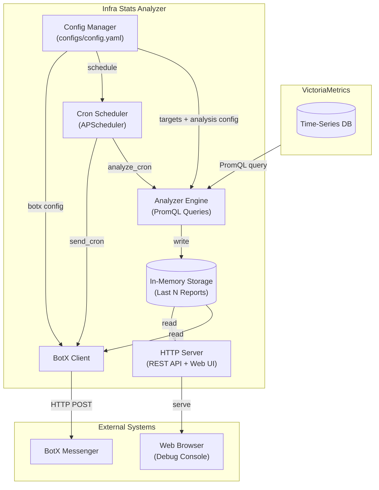

# Infra Stats Analyzer

Сервис для автоматизированного анализа метрик инфраструктуры из VictoriaMetrics. Собирает статистику CPU, памяти и дисков через PromQL-запросы к VictoriaMetrics, анализирует нагрузку контейнеров по метрикам cadvisor (CPU/память выше порога), сохраняет историю в памяти и отправляет сводные отчёты в BotX по расписанию. Запросы к VM группируются по всем инстансам и ограничиваются rate-limiter'ом и пулом одновременных запросов.

---

## Архитектура



---

## Структура проекта

```text
.
├── app/                            # Python-пакет (FastAPI + asyncio)
│   ├── __init__.py
│   ├── main.py                     # create_app, lifespan, uvicorn-запуск
│   ├── logger.py                   # Настройка логирования (LOG_LEVEL / LOG_FORMAT)
│   ├── config/
│   │   ├── config.py               # Dataclasses + load_config (YAML, Go-дурации)
│   │   └── manager.py              # Thread-safe Manager (get/save)
│   ├── vmclient/
│   │   └── vmclient.py             # HTTP-клиент к VM: semaphore, token bucket, retry/backoff/jitter
│   ├── analyzer/
│   │   ├── analyzer.py             # Engine, TargetStats, AnalysisReport, ContainerStat, compute_diffs
│   │   └── container.py            # Анализ контейнеров по cadvisor (периоды + диффы)
│   ├── storage/
│   │   └── storage.py              # In-memory кольцевой буфер
│   ├── notifier/
│   │   └── notifier.py             # BotX клиент + история отправок (50 записей)
│   ├── scheduler/
│   │   └── scheduler.py            # Крон-планировщик (APScheduler) + статус JobStatus
│   ├── handlers/
│   │   └── handlers.py             # REST-хендлеры (FastAPI Router)
│   └── web/
│       └── static/
│           ├── index.html          # SPA-консоль (тёмная тема)
│           ├── app.js
│           └── app.css
├── configs/
│   ├── config.yaml                 # Основной файл конфигурации
│   └── vm-scrape.yml               # (dev) Конфиг скрапинга для VM
├── docs/
│   └── source/
│       └── index.md                # Документация
├── tests/                          # Unit-тесты (unittest)
│   ├── test_vmclient.py            # token bucket, retry, парсинг серий
│   └── test_analyzer.py            # diffs, round_value, to_dict (Go-совместимость)
├── Dockerfile                      # python:3.11-slim, non-root appuser
├── docker-compose.yml              # Compose: infra-stats + VM + node-exporter
└── requirements.txt                # fastapi, uvicorn, httpx, PyYAML, APScheduler
```

---

## Конфигурация (`configs/config.yaml`)

```yaml
victoria_metrics:
  url: "http://localhost:8428"
  timeout: 60s
  max_concurrent: 8      # максимум одновременных запросов
  rps: 20                # лимит запросов в секунду
  retries: 3             # ретраи на 429/503/5xx (backoff + jitter)

targets:
  - name: "server-01"
    instance: "192.168.1.10:9100"
    mountpoints:
      - "/"
      - "/var/lib"
      - "/data"
    description: "Main application server"

analysis:
  cpu: true
  memory: true
  disk: true
  oom: true
  periods:
    - "1d"
    - "7d"
    - "14d"

containers:
  enabled: false
  change_threshold: 5    # п.п. — контейнер попадает в отчёт при большем изменении метрики
  high_threshold: 70     # % — контейнер попадает в отчёт при использовании ресурсов выше этого
  cpu_threshold: 80      # % — подсветка ⚠️ при превышении
  mem_threshold: 95      # % — подсветка ⚠️ при превышении
  filters:
    envir: "prod"        # опциональные фильтры по лейблам cadvisor
    department: "platform"

scheduler:
  analyze_cron: "0 0 * * *"
  send_cron: "0 8 * * *"
  jitter: 30s            # случайная задержка перед запуском анализа

notifier:
  botx:
    enabled: true
    api_url: "https://botx.example.com/api/v4/botx/notifications/direct"
    chat_id: "${BOTX_CHAT_ID}"
    bearer_token: "${BOTX_BEARER_TOKEN}"

storage:
  path: "data/infra_stats.db"   # SQLite-файл истории (ротация 100 отчётов / 50 нотификаций)
```

### Поля конфигурации

| Поле | Тип | Описание |
|---|---|---|
| `victoria_metrics.url` | string | Адрес VictoriaMetrics (http/https) |
| `victoria_metrics.timeout` | duration | Таймаут запросов к VM |
| `victoria_metrics.max_concurrent` | int | Максимум одновременных запросов к VM (worker pool) |
| `victoria_metrics.rps` | int | Лимит запросов к VM в секунду (token bucket) |
| `victoria_metrics.retries` | int | Ретраи на 429/503/5xx и сетевые ошибки (backoff + jitter) |
| `targets[].name` | string | Отображаемое имя сервера |
| `targets[].instance` | string | Instance label в VM (обычно `host:9100`) |
| `targets[].mountpoints` | []string | Список точек монтирования для анализа дисков (если не указан — `/`) |
| `analysis.cpu` | bool | Анализировать CPU |
| `analysis.memory` | bool | Анализировать память |
| `analysis.disk` | bool | Анализировать диск |
| `analysis.oom` | bool | Проверять OOM-события (OOM Killer) |
| `analysis.periods` | []string | Временные окна (1d, 7d, 14d и т.д.) |
| `containers.enabled` | bool | Включить анализ контейнеров по cadvisor |
| `containers.change_threshold` | float | Изменение метрики в п.п. — контейнер с большим диффом попадает в отчёт |
| `containers.high_threshold` | float | % использования ресурсов (своего лимита или ВМ) — контейнер выше попадает в отчёт |
| `containers.cpu_threshold` | float | Порог CPU, % — подсветка ⚠️ в отчёте |
| `containers.mem_threshold` | float | Порог памяти, % — подсветка ⚠️ в отчёте |
| `containers.filters` | map | Доп. фильтры по лейблам cadvisor (envir, job, department и т.д.) |
| `scheduler.analyze_cron` | string | Cron-расписание запуска анализа |
| `scheduler.send_cron` | string | Cron-расписание отправки отчёта |
| `scheduler.jitter` | duration | Случайная задержка (0..jitter) перед анализом — чтобы копии сервиса не били в VM одновременно |
| `notifier.botx.enabled` | bool | Включить отправку в BotX |
| `notifier.botx.api_url` | string | URL BotX API |
| `notifier.botx.chat_id` | string | ID чата/группы (переопределяется через `BOTX_CHAT_ID`) |
| `notifier.botx.bearer_token` | string | Токен (переопределяется через `BOTX_BEARER_TOKEN`) |
| `storage.path` | string | Путь к SQLite-файлу истории (переопределяется через `STORAGE_PATH`) |

### PromQL-запросы

Для снижения нагрузки на VictoriaMetrics запросы группируются по всем инстансам
сразу (`by (instance)` / `by (instance, mountpoint)`), а не выполняются на каждый
инстанс отдельно. Итог — 12 запросов за прогон анализа независимо от числа ВМ.

Все селекторы **фильтруются по инстансам из конфига** (`instance=~"vm1|vm2|…"`,
RE2-экранирование) — VM возвращает только нужные ВМ и контейнеры, а не всё подряд.
Запросы идут **POST**-ом на `/api/v1/query` (нет лимита длины URL при сотнях ВМ),
выполняются параллельно под семафором (8) и token-bucket (rps), периоды — по 3
запроса за период для контейнеров.

| Метрика | Запрос |
|---|---|
| **CPU** (средняя за период) | `100 - avg by (instance) (rate(node_cpu_seconds_total{mode="idle"}[1d])) * 100` |
| **Memory** (средняя за период) | `avg_over_time((1 - node_memory_MemAvailable_bytes / node_memory_MemTotal_bytes)[1d:2m]) * 100` |
| **Disk** (средняя за период, per-mountpoint) | `avg by (instance, mountpoint) (avg_over_time((1 - node_filesystem_avail_bytes / node_filesystem_size_bytes)[1d:2m])) * 100` |
| **OOM** (число OOM kill за период) | `sum by (instance) (increase(node_vmstat_oom_kill[1d]))` |
| **Container Mem %** (за период) | `avg_over_time((container_memory_working_set_bytes{name!=""} / container_spec_memory_limit_bytes{name!=""})[1d:2m]) * 100` |
| **Container Mem/ВМ %** (за период) | `avg_over_time(container_memory_working_set_bytes{name!=""}[1d:2m]) / node_memory_MemTotal_bytes{instance!=""} * 100` |
| **Container CPU % от лимита** (за период) | `sum by (envir, job, instance, name, department) (rate(container_cpu_usage_seconds_total{name!=""}[1d])) / sum by (envir, job, instance, name, department) ((container_spec_cpu_quota{name!=""} > 0) / (container_spec_cpu_period{name!=""} > 0)) * 100` |
| **Container CPU/ВМ %** (за период) | `sum by (envir, job, instance, name, department) (rate(container_cpu_usage_seconds_total{name!=""}[1d])) / count by (instance) (node_cpu_seconds_total{instance!=""}) * 100` |

---

## REST API Specification

### Endpoints

| Метод | Путь | Описание |
|---|---|---|
| `GET` | `/healthcheck` | Healthcheck, возвращает `ItsOK` |
| `GET` | `/api/status` | Последний отчёт анализа |
| `GET` | `/api/reports` | Все сохранённые отчёты |
| `POST` | `/api/analyze` | Запустить анализ принудительно |
| `POST` | `/api/clear` | Очистить историю отчётов |
| `GET` | `/api/containers` | Контейнеры из последнего отчёта (периоды + диффы) |
| `GET` | `/api/config` | Получить текущий конфиг |
| `GET` | `/api/scheduler` | Статус cron-задач (последний запуск, успех/ошибка) |
| `GET` | `/api/notifications` | История отправок уведомлений (макс. 50) |
| `GET` | `/api/preview` | Предпросмотр сообщения для BotX (plain text) |
| `POST` | `/api/test/vm` | Проверка подключения к VictoriaMetrics |
| `POST` | `/api/test/clouds` | Валидация конфигурации Clouds (BotX) |
| `POST` | `/api/test/send` | Отправка тестового сообщения в Clouds |
| `GET` | `/` | Web debug console |

### GET /healthcheck

```
GET /healthcheck
→ 200 OK
Body: ItsOK
```

### GET /api/status

Контейнеры в ответе отдаются **только значимые** (дифф > `change_threshold` п.п. или ресурсы > `high_threshold` %) — чтобы ответ оставался лёгким при сотнях ВМ. Полный список — в `/api/containers`.

```
GET /api/status
→ 200 OK

{
  "timestamp": "2026-07-29T00:57:34.879004597+03:00",
  "targets": [
    {
      "name": "server-01",
      "cpu": [
        { "period": "1d", "value": 23.4, "diff": 1.2 },
        { "period": "7d", "value": 22.1, "diff": -0.5 },
        { "period": "14d", "value": 20.5 }
      ],
      "memory": [
        { "period": "1d", "value": 62.1, "diff": -0.3 },
        { "period": "7d", "value": 61.8, "diff": -0.7 },
        { "period": "14d", "value": 60.3 }
      ],
      "disks": [
        {
          "mountpoint": "/",
          "metrics": [
            { "period": "1d", "value": 45.2, "diff": 0.4 },
            { "period": "7d", "value": 44.8, "diff": 0.1 },
            { "period": "14d", "value": 43.1 }
          ]
        }
      ],
      "oom": [
        { "period": "1d", "count": 2, "diff": 1 },
        { "period": "7d", "count": 5 }
      ]
    }
  ],
  "containers": [
    {
      "name": "app-a",
      "instance": "vm-01:8080",
      "job": "cadvisor",
      "envir": "prod",
      "department": "platform",
      "cpu": [
        { "period": "1d", "value": 87.5, "diff": 3.1 },
        { "period": "7d", "value": 84.4 }
      ],
      "memory": [
        { "period": "1d", "value": 97.0, "diff": 2.2 },
        { "period": "7d", "value": 94.8 }
      ]
    }
  ]
}
```

→ `404` если отчётов ещё нет:
```json
{ "error": "no reports yet" }
```

### GET /api/reports

```
GET /api/reports
→ 200 OK

[
  { "timestamp": "...", "targets": [...] },
  { "timestamp": "...", "targets": [...] }
]
```

### POST /api/analyze

```
POST /api/analyze
→ 200 OK

{
  "timestamp": "2026-07-29T00:57:34.879004597+03:00",
  "targets": [...]
}
```

Запускает полный цикл анализа для всех целей из конфига и сохраняет результат в историю.

### POST /api/clear

```
POST /api/clear
→ 200 OK

{ "status": "cleared" }
```

### GET /api/containers

```
GET /api/containers
→ 200 OK

[
  {
    "name": "app-a",
    "instance": "vm-01:8080",
    "job": "cadvisor",
    "envir": "prod",
    "department": "platform",
    "cpu": [
      { "period": "1d", "value": 87.5, "diff": 3.1 },
      { "period": "7d", "value": 84.4, "diff": -0.5 },
      { "period": "14d", "value": 84.9 }
    ],
    "memory": [
      { "period": "1d", "value": 97.0, "diff": 2.2 },
      { "period": "7d", "value": 94.8 },
      { "period": "14d", "value": 91.3 }
    ],
    "cpu_vm": [
      { "period": "1d", "value": 12.4, "diff": 0.9 },
      { "period": "7d", "value": 11.5 },
      { "period": "14d", "value": 11.2 }
    ],
    "mem_vm": [
      { "period": "1d", "value": 8.7, "diff": 0.2 },
      { "period": "7d", "value": 8.5 },
      { "period": "14d", "value": 8.1 }
    ]
  }
]
```

Возвращает список контейнеров из последнего отчёта (те же периоды, что и для ВМ,
с диффами к предыдущему прогону). → `404` если контейнерный анализ не включён
или отчётов ещё нет.

В историю (`/api/reports`) и `/api/status` контейнеры попадают только значимые
(как в BotX-отчёте); `/api/containers` возвращает их полностью.

### GET /api/config

```
GET /api/config
→ 200 OK

{
  "victoria_metrics": { "url": "http://victoria-metrics:8428", "timeout": 30.0, "max_concurrent": 8, "rps": 20.0, "retries": 3 },
  "targets": [...],
  "analysis": { "cpu": true, "memory": true, "disk": true, "oom": true, "periods": ["1d","7d","14d"] },
  "containers": { "enabled": true, "change_threshold": 5, "high_threshold": 70, "cpu_threshold": 80, "mem_threshold": 95 },
  "scheduler": { "analyze_cron": "0 0 * * *", "send_cron": "0 8 * * *", "jitter": 30.0 },
  "notifier": { "botx": { "enabled": true, ... } }
}
```

### GET /api/scheduler

```
GET /api/scheduler
→ 200 OK

{
  "analyze_cron": "0 0 * * *",
  "send_cron": "0 8 * * *",
  "status": {
    "analyze": {
      "last_run": "2026-07-29T00:00:00+03:00",
      "last_success": true,
      "last_error": ""
    },
    "send": {
      "last_run": "2026-07-29T08:00:00+03:00",
      "last_success": false,
      "last_error": "botx API returned non-2xx status code: 401"
    }
  }
}
```

Поле `last_error` присутствует только при неудачном выполнении. `last_success=false` с пустой ошибкой означает, что задача ещё ни разу не запускалась.

### GET /api/notifications

```
GET /api/notifications
→ 200 OK

[
  {
    "timestamp": "2026-07-29T08:00:00+03:00",
    "success": true,
    "chat_id": "chat-123"
  },
  {
    "timestamp": "2026-07-29T08:00:00+03:00",
    "success": false,
    "error": "HTTP 401",
    "chat_id": "chat-123"
  }
]
```

Возвращает массив записей (не более 50), отсортированных от старых к новым. Поле `error` присутствует только при неудачной отправке.

---

## Масштабирование (сотни ВМ)

Число запросов к VM за прогон **константно** (12 на таргеты + 12 на контейнеры)
и не зависит от размера конфига. При 300+ ВМ работает следующее:

1. **Серверная фильтрация**: селекторы ограничены инстансами конфига
   (`instance=~"…"`) — VM не считает и не возвращает чужие ВМ и контейнеры.
   Контейнеры с инстансов вне конфига в отчёт не попадают.
2. **POST-запросы**: длинная regex на 300 инстансов (~7 КБ) не упирается в лимиты
   длины URL.
3. **Параллелизм**: таргеты гоняются 4-мя независимыми циклами (cpu/mem/disk/oom),
   контейнеры — по 3 запроса за период; семафор и token bucket ограничивают
   одновременную нагрузку на VM.
4. **Хранилище**: полный последний отчёт в памяти (для диффов и `/api/containers`),
   история — только со значимыми контейнерами и **на диске (SQLite)**: память не
   растёт линейно с числом контейнеров, история переживает рестарт и ротируется
   (100 отчётов / 50 нотификаций).
5. **Ретраи**: учитывается `Retry-After`, на 503 бэкoff длиннее (меньше усиления
   нагрузки при перегрузке), период-независимые запросы кэшируются на 5 минут.

---

## Хранилище (SQLite)

Долгосрочное хранение результатов — в SQLite-файле (`storage.path`, в Docker
volume `statsdata:/app/data`). Это не in-memory: история переживает рестарт сервиса
и не занимает оперативную память.

- Таблицы `reports` (JSON-отчёт, только значимые контейнеры) и `notifications`
  (записи об отправке в BotX); WAL-режим.
- Полный последний отчёт держится в памяти для вычисления диффов и
  `/api/containers`; при старте восстанавливается из БД — диффы считаются и после
  рестарта.
- Ротация по лимиту: в БД остаётся последние **100 отчётов** и **50 нотификаций**,
  старые удаляются при записи — файл не растёт бесконечно.
- `/api/reports`, `/api/notifications` читают историю из БД на каждый запрос.

---

## Формат отчёта в BotX

```
📊 *Infra Stats Report*
🕒 *Time:* 2026-07-29 14:30:00

🖥 *server-01*
   📈 CPU: 1d: 23.4% (+1.2) | 7d: 22.1% (-0.5) | 14d: 20.5%
   📈 Mem: 1d: 62.1% (-0.3) | 7d: 61.8% (-0.7) | 14d: 60.3%
   💾 root: 1d: 45.2% (+0.4) | 7d: 44.8% (+0.1) | 14d: 43.1%
   💾 /var/lib: 1d: 8.9% (+0.0) | 7d: 8.9% (+0.0) | 14d: 8.9%
   💀 OOM (1d): 2 kill(s) (+1)
   💀 OOM (7d): 5 kill(s)

🖥 *server-02*
   📈 CPU: 1d: 45.2% | 7d: 44.8% | 14d: 43.1%
   📈 Mem: 1d: 78.5% | 7d: 77.9% | 14d: 76.2%
   💾 /data: 1d: 12.8% | 7d: 12.5% | 14d: 11.9%

🐳 *Containers*
   (изм. >5% или >70% ресурсов)

   ⚠️ 🐳 *app-a* (vm-01:8080)
      📈 CPU: 1d: 87.5% (+3.1) | 7d: 84.4% | 14d: 84.9%
      📈 Mem: 1d: 97.0% (+2.2) | 7d: 94.8% | 14d: 91.3%
      📈 CPU/ВМ: 1d: 12.4% (+0.9) | 7d: 11.5% | 14d: 11.2%
      📈 Mem/ВМ: 1d: 8.7% (+0.2) | 7d: 8.5% | 14d: 8.1%
   🐳 *db* (vm-02:8080)
      📈 CPU: 1d: 100.0% | 7d: 95.1% | 14d: 90.0%
      📈 Mem: 1d: 98.8% (+3.5) | 7d: 95.3% | 14d: 93.0%
```

В секцию контейнеров попадают только **значимые** контейнеры: изменившиеся более
чем на `containers.change_threshold` п.п. или использующие более `containers.high_threshold` %
ресурсов (своего лимита или всей ВМ). Подсветка ⚠️ ставится при превышении
`containers.cpu_threshold` / `containers.mem_threshold`.

### GET /api/preview

```
GET /api/preview
→ 200 OK

{
  "text": "📊 *Infra Stats Report*\n🕒 *Time:* ...\n\n🖥 *server-01*\n   📈 CPU: 1d: ...",
  "timestamp": "2026-07-29T..."
}
```

→ `404` если отчётов ещё нет:
```json
{ "error": "no reports available" }
```

### POST /api/test/vm

```
POST /api/test/vm
→ 200 OK

{ "success": true }
```

При ошибке:
```json
{ "success": false, "error": "vm ping failed: ..." }
```

### POST /api/test/clouds

```
POST /api/test/clouds
→ 200 OK

{ "success": true, "api_url": "https://...", "chat_id": "chat-xxx" }
```

При ошибке:
```json
{ "success": false, "error": "botx api_url is empty" }
```

### POST /api/test/send

```
POST /api/test/send
→ 200 OK

{ "success": true }
```

Отправляет последний отчёт в BotX, используя текущую конфигурацию. При ошибке возвращает `{ "success": false, "error": "..." }`.

---

Поле `diff` показывает изменение относительно предыдущего отчёта. Значение в скобках — дельта: `(+X.Y)` означает рост (ухудшение), `(-X.Y)` — снижение (улучшение). Для первой записи после запуска diff отсутствует.

---

## Запуск

### Docker Compose (рекомендуемый)

```bash
# Сборка и запуск всех сервисов
docker compose up -d --build

# Проверка статуса
docker compose ps

# Логи
docker compose logs -f infra-stats
```

### Локальный запуск

```bash
# Требуется: Python 3.11+, VictoriaMetrics (локально или удалённо)

python3 -m venv .venv
.venv/bin/pip install -r requirements.txt
LOG_LEVEL=debug .venv/bin/python -m app.main
```

Локальный конфиг по умолчанию: `configs/config.yaml`. Путь можно переопределить через `CONFIG_PATH`.

---

## Переменные окружения

| Переменная | Описание |
|---|---|
| `CONFIG_PATH` | Путь к конфигурационному файлу (по умолч. `configs/config.yaml`) |
| `LOG_LEVEL` | `debug`, `info`, `warn`, `error` (по умолч. `info`) |
| `LOG_FORMAT` | `text` или `json` (по умолч. `text`) |
| `BOTX_BEARER_TOKEN` | Bearer-токен для BotX (переопределяет значение из YAML) |
| `BOTX_CHAT_ID` | ID чата BotX (переопределяет значение из YAML) |

---

## Безопасность

1. **In-memory storage**: история отчётов хранится только в памяти, не пишется на диск (кроме конфига).
2. **Токены через ENV**: Bearer-токен и Chat ID можно задать через переменные окружения — они имеют приоритет над YAML и не светятся в репозитории.
3. **Docker**: контейнер запускается от непривилегированного пользователя `appuser`, сброшены все capabilities (`cap_drop: ALL`), запрещено повышение привилегий (`no-new-privileges=true`).
4. **VictoriaMetrics**: используется как read-only источник данных — запись метрик не производится.
